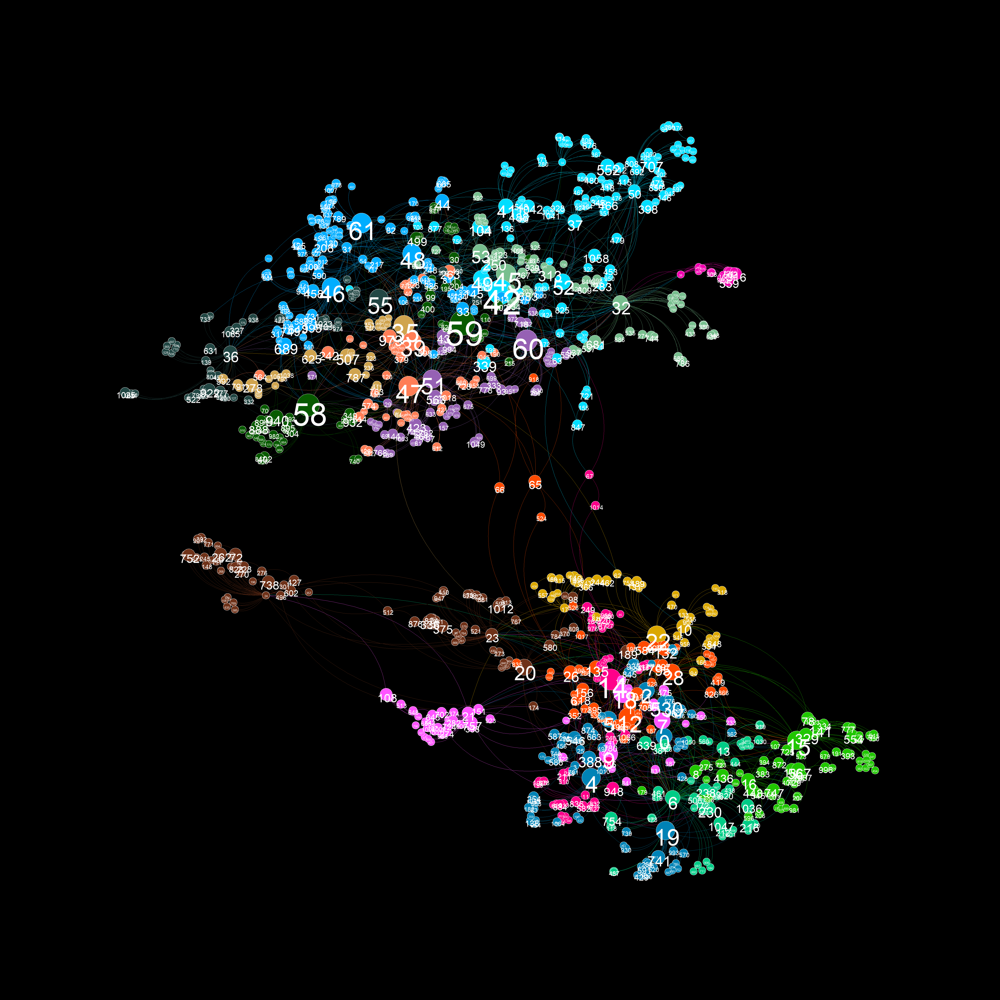
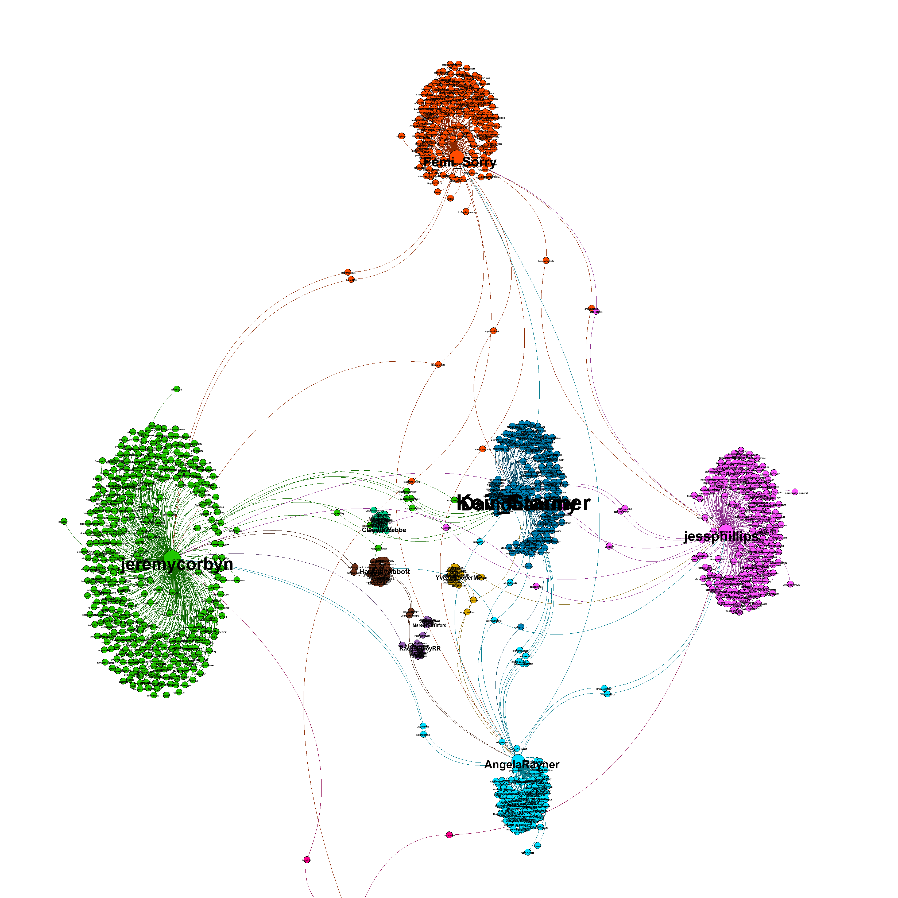
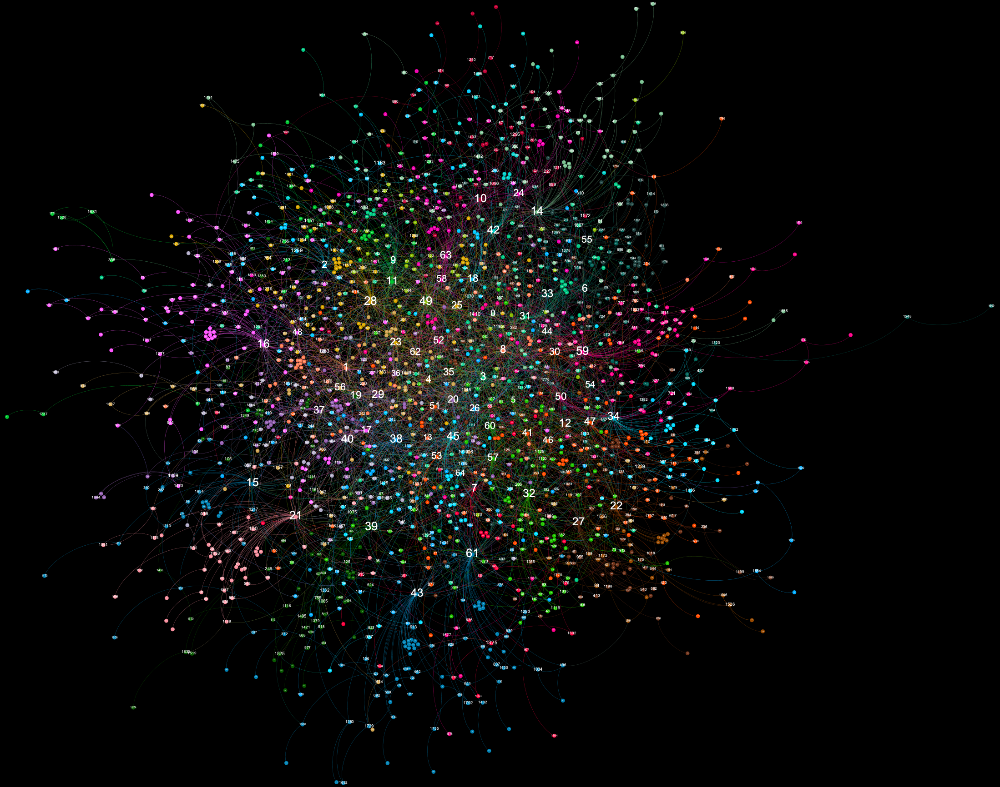
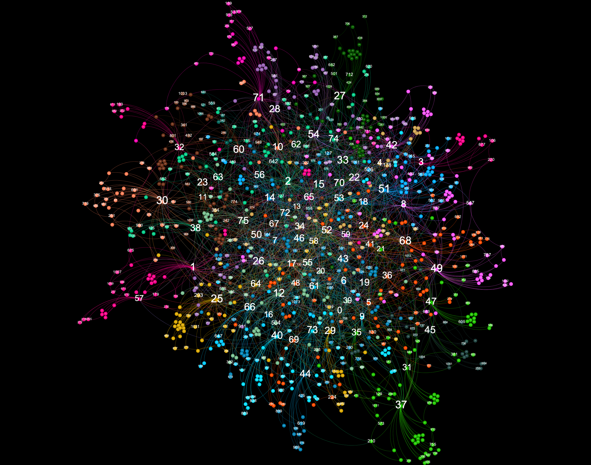
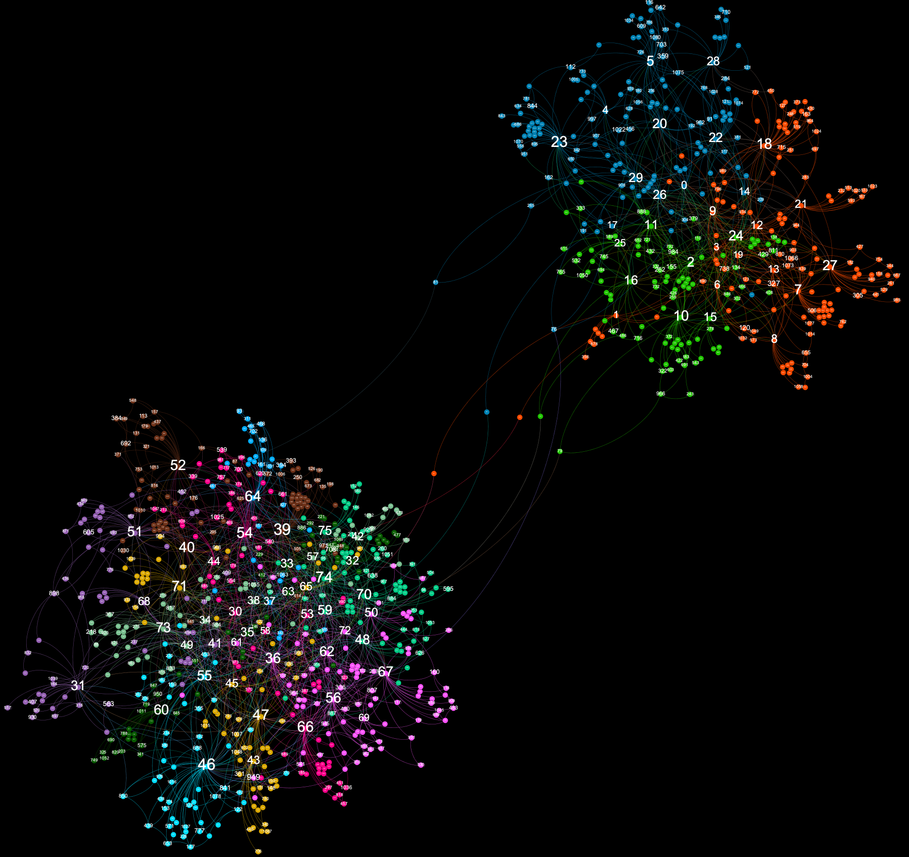
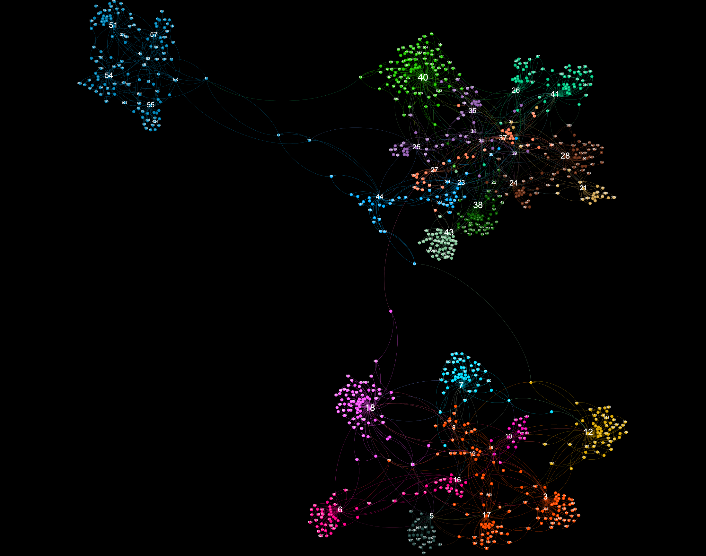
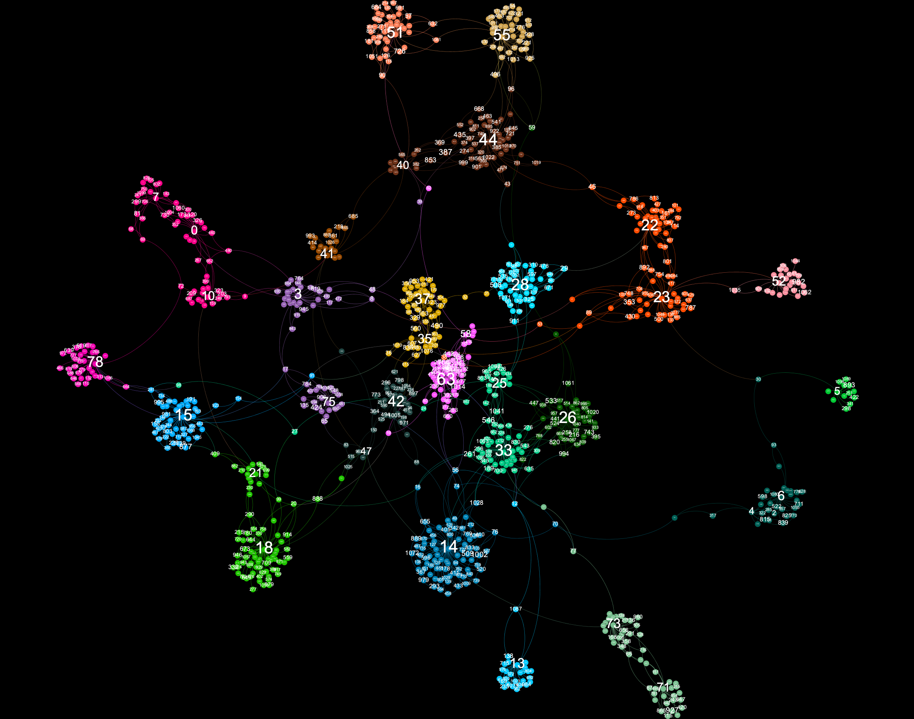
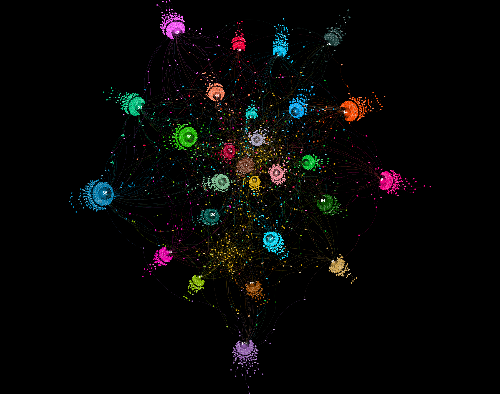
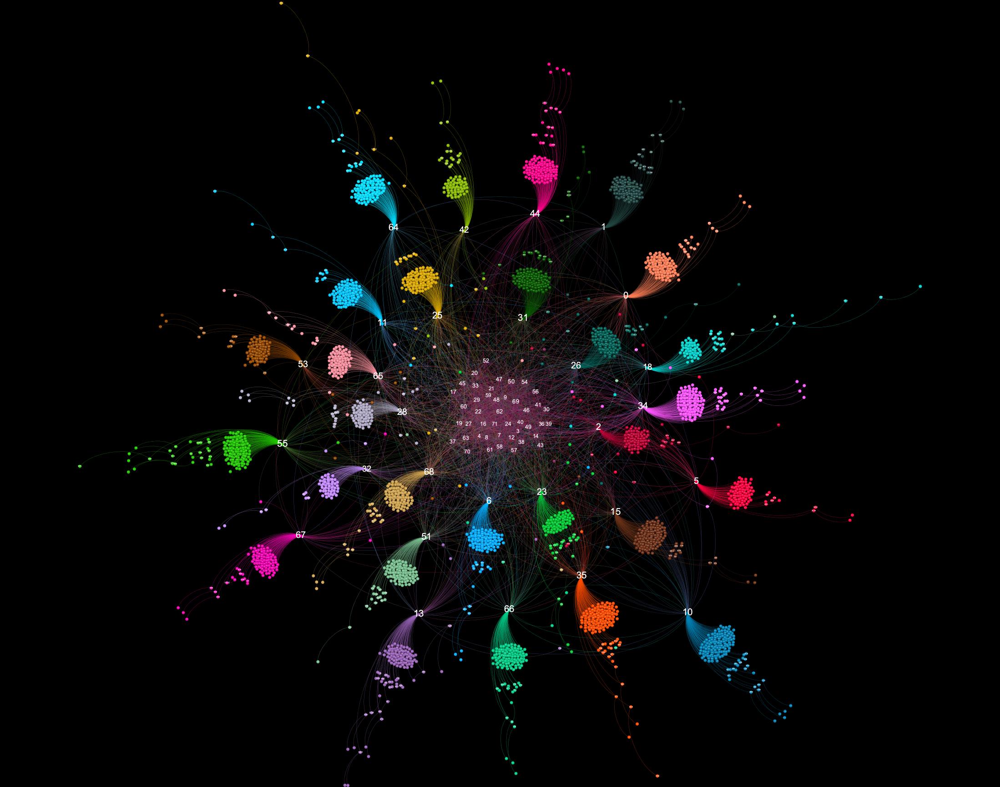
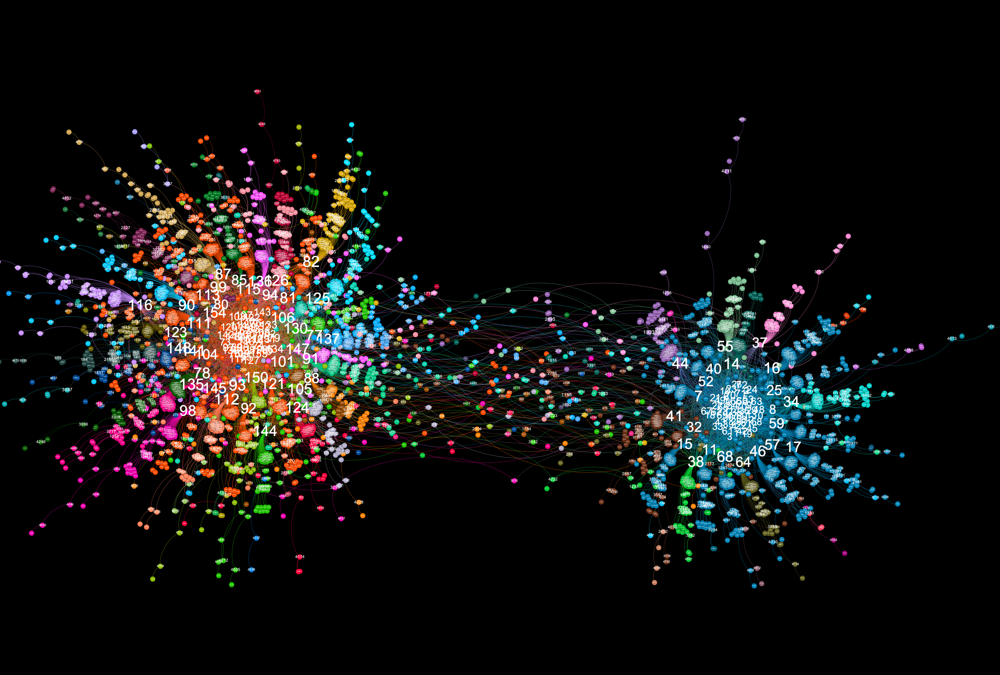

# graph_simulations
Synthesising graphs and simulating things

This repository contains tools for creating, manipulating, and visualizing node-edge network graph representations. It also contains some code that puts those tools to use. The tools are described in the following sections.

# graphviz.py

I have been using gephi (https://gephi.org/) for many years to visualize node-edge graphs in an appealing and eye-catching manner. Even though the tool is straighforward to use and contains many useful features, I have always wanted for a programmatic method to generate similarly visually appealing graph plots. Unfortunately, the options available don't hold a candle to gephi. As such, I decided to create a tool capable of creating visualizations similar to those that can be generated with gephi. _graphviz.py_ is that tool.

An example generated graph visualization looks like this:


Here is an example of a visualization generated from captured Twitter data using **background_mode** = "white"


In order to use _graphviz.py_ you'll need to install the following:

**networkx** (https://networkx.org/)
`pip install networkx`

**louvain community detection** (https://github.com/taynaud/python-louvain)
`pip install python-louvain`

**forceatlas2 for python** (https://github.com/bhargavchippada/forceatlas2)
`pip install fa2`

**numpy** (https://numpy.org/)
`pip install numpy`

**pillow** (https://pillow.readthedocs.io/en/stable/)
`pip install Pillow`

In order to create a graph visualization, you'll need to create the following structures in python:

A dict that describes a graph in the following format:
```
{s1:{t1:w, t2:w, t3:w...} s2:{t3:w, t4:w...}}
```


You thus create the graph visualization like this:
```
from graphviz import *

gv = GraphViz(interactions)
im = gv.make_graphviz()
im.save("graph.png") # to save it
display(im) # if you're running this in a jupyter notebook
```

## Options

**mag_factor** (default: 1.0) Defines the size of the image output. At a value of 1.0, the size of the image is 1200 x 1200. Setting this to 4.0 or higher will allow even the smallest labels on a resulting image to be examined.

**scaling** (default: 5.0) A variable to be passed into the forceatlas2 algorithm. See https://github.com/bhargavchippada/forceatlas2 for details.

**gravity** (default: 20.0) A variable to be passed into the forceatlas2 algorithm. See https://github.com/bhargavchippada/forceatlas2 for details.

**iterations** (default: 200) A variable to be passed into the forceatlas2 algorithm. See https://github.com/bhargavchippada/forceatlas2 for details. Determines how many iterations the algorithm runs. A higher value will lead to longer runtime.
                 
**eadjust** (default: 0.5) Applies slight dimming to edges, in-line with how gephi plots graphs. A lower value creates dimmer edges.

**expand** (default: 0.3) Equivalent to gephi's expand transformation. Moves all nodes away from the center point by the defined factor. Note that this will expand the canvas, resulting in a larger image.

**zoom** (default: [[0.0,0.0],[1.0,1.0]]) A manual method for zooming into the graph. The first two values represent how far from the left and top edges to zoom, the second two values represent right and bottom edges.

**auto_zoom** (default: True) When data is collected from natural sources (such as social networks), there are sometimes small "blobs" of nodes that aren't connected to the main graph. When forceatlas2 is applied, these blobs fly far away from the main clump. This causes the visualization to be "zoomed out". Autozoom corrects this by automatically setting the **zoom** variable to center the main graph.

**label_font** (default: "Arial Bold") the font to use when creating labels. Note that you must have the truetype (.ttf) font with the exact name installed on your machine.

**min_font_size**, **max_font_size** denote minimum and maximum font sizes in the resulting visualization.
                 
**font_scaling** (default: "lin") This variable determines how fonts scale. Values can be "lin" (linearly), "pow" (highlights fewer labels), "root" (highlights more labels) or "fixed". Both the "pow" and "root" options can include a float (e.g. "pow2.5") that denotes the value. If no value is included (i.e. "pow") the value will be 2. The option "fixed" can include an integer value for the exact size (e.g. "fixed12"). If a value is not included in the "fixed" parameter, the maximum value will be used (i.e. for fonts, **max_font_size** will be used). Generally speaking, in order to get a complex graph visualization into a presentable state, you want only some labels to be readable. This is achieved by altering **min_font_size**, **max_font_size** and **font_scaling**. If the distribution of values used to set label size is high, "lin" or "root" may be better. If the distribution os low, try "pow". For simple graphs, "fixed" may be the best option. This advice also applies to node sizing.

**min_node_size**, **max_node_size**, **node_scaling** are the same as above, but for node circles.

**min_edge_size**, **max_edge_size**, **edge_scaling** are the same as above, but for edge lines.

**background_mode** (default: "black") - can be either "black" or "white". An example was shown above.

**edge_style** (default: "curved") can be either "curved" or "straight". Try it out.

**extra_vars** (default: None) This option allows additional data to be supplied to the class. Extra vars must be supplied in the format: {"var_name": n1:val, n2:val, ..}. All nodes in the graph should contain a label.

**color_by** (default: "modularity") This option can be used to apply node coloring based on a different set of values. Values passed in via **extra_vars** can be used in this fashion.

**size_by** (default: "out_degree") This option can be used to change node and label sizes based on a different set of values. By default, graphviz.py includes "in_degree" and "out_degree". Values passed in via **extra_vars** can be used in this fashion.

**palette** (default: "intense") This option allows the user to switch between two default palettes: "intense" and "gradient". The "intense" palette is designed for coloring nodes based on modularity. If you wish to color nodes based on their values, use "gradient" (which provides a spectrum between red and blue).

You can find example settings in some of the other scripts in this repo, including _graph_examples.ipynb_, _plot_timelapse.py_, and _test_graphviz.py_.

Generally speaking, in order to find correct settings, start by passing your graph into graphviz and viewing the resulting output with default settings. Then add options to the gv=GraphViz() call and reiterate until satisfactory results have been achieved (in a similar way to working directly with gephi). Generating a new image should only take a few seconds (depending on the size of the graph, number of iterations, etc.)


# graph.py

graph.py is a python program for creating node-edge graphs from scratch. The tool is highly configurable, allowing for the creation of many distinct node-edge graph phenotypes. The tool requires you have the following python libraries installed:

**networkx** (https://networkx.org/)
`pip install networkx`

**louvain community detection** (https://github.com/taynaud/python-louvain)
`pip install python-louvain`

The following code creates a graph using default settings and then prints some statistics about it.
```
from graph import *

g = Graph()
g.print_basic_stats()
g.print_community_stats()
```

The point of the graph.py tool is to allow researchers to create node-edge graphs with interesting properties. The properties of the generated graphs can be studied, and they can also be utilized in, for instance, simulations (more on that later). The Graph() initialization routine allows for the following parameters:

**num_nodes** (default:1000) is a value that is used in graph generation. It does not specifically determine the final number of nodes in a generated graph. However, the larger the **num_nodes** value, the larger the graph.

**num_cores** (default: 1) in the initial phase of graph generation, a number of cores are created in the following way - a set of nodes (roughly equal to num_nodes/20 * num_cores) is created for each core. These nodes are then connected to one another based on the **intra_core_connectivity** variable. Cores are then connected together (based on variable described below), and additional nodes are finally added to the entire graph. The minimum value for **num_cores** is 1.

**intra_core_connectivity** (default: 0.3) defines the density of connections inside the initially created cores. Higher values add more edges during initial core formation.

**core_connectivity** (default: 0.7) defines the density of connectivity between initially formed cores. The mean number of nodes across all created cores is multiplied by this coefficient to determine the number of connections to be made between cores. Each time two cores are connected, the cores to be connected are determined at random. Hence, for larger values of **num_cores**, larger values of **core_connectivity** may be required. Note that this setting is ignored when **num_cores** is 1.

**add_nodes_random** (default: 0.4) After cores have been created and connected together, additional nodes are added to the graph. In one case, new nodes are created and connected to other nodes at random. This value is multiplied by **num_nodes** to determine how many nodes are created in this way.

**add_nodes_popularity** (default: 1.4) After cores have been created and connected together, additional nodes are added to the graph. In one case, new nodes are created and connected to other nodes such that nodes with higher numbers of connected nodes are more likely to further receive new nodes. This value is multiplied by **num_nodes** to determine how many nodes are created in this way.

**popularity_cutoff** (default: 1.0) When choosing a node such that existing connections weight the node more likely to be chosen, all nodes are still considered in the final categorical distribution. To limit the number of nodes available for selection, one may set **popularity_cutoff** to a value between 0 and 1. A lower value will select a smaller portion of the most connected nodes.

**connect_cores_directly** (default: 0.2) defines the chance that nodes belonging to cores are connected directly to other cores, or via intermediate nodes. Setting this value to 0 will guarantee that cores are always connected via intermediate nodes. Setting the value to 1 ensures cores are always connected directly. Note that this setting is ignored when **num_cores** is 1.

**connect_second_neighbours** (default: 1.5) after random nodes are added to the graph, some additional edges are created between existing nodes. Some connections are intentionally formed between a node and its second neighbour. The number of connections made this way is determined by multiplying **num_nodes** with **connect_second_neighbours**.

**connect_random** (default: 0.4) after random nodes are added to the graph, some additional edges are created between existing nodes. Some connections are intentionally formed between a randomly selected pair of nodes. The number of connections made this way is determined by multiplying **num_nodes** with **connect_random**.

The above description of graph.py's initialization options probably doesn't make sense. However, I will illustrate how the parameters work with a few examples.

## Example 1: default settings

Default settings are as follows:
```
g = Graph(num_nodes=1000,
          num_cores=1,
          intra_core_connectivity=0.3,
          core_connectivity=0.7,
          add_nodes_random=0.4,
          add_nodes_popularity=1.4,
          popularity_cutoff=1.0,
          connect_cores_directly=0.2,
          connect_second_neighbours=1.5,
          connect_random=0.4)
 ```


## Example 2: no random nodes or connections formed

In this config you will notice more "umbrella" clusters connected to nodes with high in-degree.
```
g = Graph(num_nodes=1000,
          num_cores=1,
          intra_core_connectivity=0.3,
          core_connectivity=0.3,
          add_nodes_random=0.0,
          add_nodes_popularity=1.0,
          popularity_cutoff=1.0,
          connect_cores_directly=0.2,
          connect_second_neighbours=1.0,
          connect_random=0.0)
```


## Example 3: classic two-core network

This is an example of how to create a loosely-connected two-core network. Such patterns are commonly seen when studying political content on social networks.
```
g = Graph(num_nodes=1000,
          num_cores=2,
          intra_core_connectivity=0.3,
          core_connectivity=0.2,
          add_nodes_random=0.0,
          add_nodes_popularity=1.0,
          popularity_cutoff=1.0,
          connect_cores_directly=0.0,
          connect_second_neighbours=1.0,
          connect_random=0.0)
```


## Example 4: loosely-connected three-core network

Such networks are rare in the real-world, but may be of interest to study.
```
g = Graph(num_nodes=1000,
          num_cores=3,
          intra_core_connectivity=0.3,
          core_connectivity=0.2,
          add_nodes_random=0.0,
          add_nodes_popularity=1.0,
          popularity_cutoff=0.5,
          connect_cores_directly=0.0,
          connect_second_neighbours=1.0,
          connect_random=0.0)
```


## Example 5: loosely connected disparate comunities

This is an example of what happens when **num_cores** and **core_connectivity** are set to very high values. This pattern is sometimes seen in follower-following interactions of botnet accounts on Twitter. Each separate cluster is highly connected and forms its own community. Such a graph might be interesting for simulation purposes.
```
g = Graph(num_nodes=1000,
          num_cores=6,
          intra_core_connectivity=0.1,
          core_connectivity=3.0,
          add_nodes_random=0.0,
          add_nodes_popularity=1.0,
          popularity_cutoff=0.5,
          connect_cores_directly=0.5,
          connect_second_neighbours=1.0,
          connect_random=0.0)
```


## Example 6: blobs

This configuration illustrates what happens when **add_nodes_popularity** is set to a very high value and **popularity_cutoff** is set to a very low value.
```
g = Graph(num_nodes=2000,
          num_cores=2,
          intra_core_connectivity=0.1,
          core_connectivity=0.5,
          add_nodes_random=0.1,
          add_nodes_popularity=3.0,
          popularity_cutoff=0.2,
          connect_cores_directly=0.1,
          connect_second_neighbours=0.5,
          connect_random=0.1)
```


## Example 7: jellyfish

This configuration also illustrates what happens when **add_nodes_popularity** is set to a very high value and **popularity_cutoff** is set to a very low value. However, in this example, **intra_core_connectivity** is also set high.
```
g = Graph(num_nodes=1000,
          num_cores=1,
          intra_core_connectivity=0.8,
          core_connectivity=0.5,
          add_nodes_random=0.1,
          add_nodes_popularity=3.0,
          popularity_cutoff=0.4,
          connect_cores_directly=0.1,
          connect_second_neighbours=0.3,
          connect_random=0.0)
```


## Example 8: binary system

This is a two-core example of the scenario where **add_nodes_popularity** is set to a very high value and **popularity_cutoff** is set to a very low value. In this example, **core_connectivity** and **connect_cores_directly** are both low values.
```
g = Graph(num_nodes=2000,
          num_cores=2,
          intra_core_connectivity=0.7,
          core_connectivity=0.2,
          add_nodes_random=0.5,
          add_nodes_popularity=2.0,
          popularity_cutoff=0.4,
          connect_cores_directly=0.05,
          connect_second_neighbours=0.3,
          connect_random=0.1)
```


All the above graph examples can be generated in the _graph_examples.ipynb_ notebook. Running the appropriate cell will also generate a gexf file that can be opened using gephi (https://gephi.org/). In order to run the notebook, you'll need to install requirements for graphviz.py (covered elsewhere on this page).

A jupyter notebook for playing around with and testing different configuration options is available in this repo (graph_testing.ipynb). In order to run the notebook, you'll need to install bokeh (https://docs.bokeh.org/en/latest/#)

`pip install bokeh`

# Using graph.py and graphviz.py together

# politics_simulation.py - using graph.py to create simulations

# plot_timelapse.py - using graphviz interpolation to create timelapse animations


